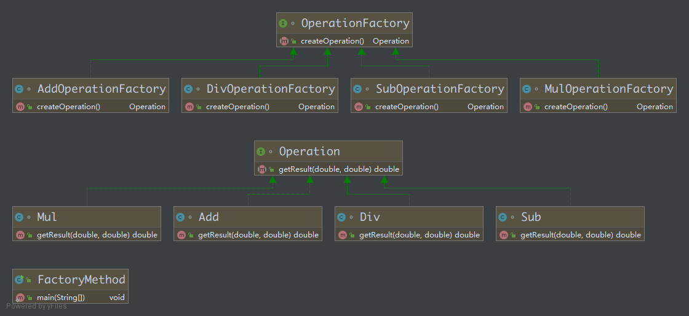

### 1. 创建型模式

创建型模式关注的是对象创建的过程, 有单例模式, 工厂模式, 生成器模式, 原型模式

#### 1. 单例模式

单例模式 `Singleton` 的核心思想: **保证一个类只有一个实例, 并且提供一个访问该实例的全局访问点**

> 常见应用场景: Windows 的任务管理器, 回收站

**单例模式的优点:**

- 由于单例模式只生成一个实例, 减少了系统性能的开销

  当一个对象的产生需要比较多的资源时, 例如读取配置, 产生其他依赖对象时, 则可以通过在应用启动时直接产生一个单例对象, 然后永久驻留内存的方式来解决

- 单例模式可以在系统设置全局的访问点, 优化共享资源访问, 例如可以设计一个单例类, 负责所有数据表的映射

**常见的五种单例模式实现方法:**

- 主要:
  - 饿汉式(线程安全, 调用效率高, 但是不能延时加载)
  - 懒汉式(线程安全, 调用效率不高, 但是可以延时加载)
- 其他:
  - 双重检测锁式(由于 `JVM` 底层内部模型原因, 偶尔会出问题, 不建议使用)
  - 静态内部类式(线程安全, 调用效率高, 但是可以延时加载)
  - 枚举单例(线程安全, 调用效率高, 不能延时加载, 并且天然地防止反射和反序列化漏洞)
  

如何选用何种模式?

- 单例对象, 占用资源少, 不需要延时加载

  **枚举单例模式** 好于 饿汉式

- 单例对象, 占用资源多, 需要延时加载

  **静态内部类模式** 好于 懒汉式和双重检测锁式


##### 1. 饿汉式

饿汉式单例模式的特点: 

- 线程安全, 调用效率高, 饿汉式单例模式没有同步方法
- 不能延时加载, 饿汉式单例模式的实例是随着类加载的过程中, 完成的初始化操作的

创建饿汉式单例模式 `HungrySingleton` 的步骤:

1. 私有静态成员 `private static final HungrySingleton instance = new HungrySingleton();` 

   在类加载时完成初始化操作, 所以不能进行延时加载 `static final` 保证内存中只有一个这样的实例存在, 保证其只能被赋值一次, 从而保证了线程安全性

2. 私有构造器 `private HungrySingleton() {}` 

   > 不能在别的类中来获取该类的对象，只能在类自身中得到自己的对象

3. 提供公开访问的方法 `public static getInstance() {}` —— 不需要同步, 因为类加载时已经初始化完毕, 也不需要判断是否为 `null` (必须为静态方法, 因为这个类已经无法通过 `new` 关键字来创建对象, 只能通过这个方法来获取成员变量 `instance`, 如果为实例方法就死锁了)

   ```Java
   public class HungrySingleton {
     // 1. 私有静态成员并赋值, 随着类一起进行初始化操作, 所以不能进行延时加载
     private static final HungrySingleton instance = new HungrySingleton();
     // 2. 私有构造器, 使得其他的类不能通过 new 来创建对象
     private HungrySingleton() {}
     // 3. 提供公开访问的方法 --- 不需要同步, 因为类加载时已经初始化完毕, 也不需要判断是否为 null
     public static HungrySingleton getInstance() {
       return instance;
     }
   }
   ```

饿汉式单例模式在类加载时就完成了初始化, 所以类加载较慢, 但获取对象的速度快

饿汉式单例模式代码中, `static` 静态变量会在类装载的时候进行初始化, 此时也不会设计多个线程对象访问该对象的问题, 虚拟机保证只会装载一次该类, 肯定不会发生并发访问的问题, 因此可以省略 `synchronized` 关键字


饿汉式单例模式的**优点**: **调用效率高**

饿汉式单例模式也有一些**缺点**:

- **资源利用率低**, 如果只是加载本类, 而不是需要调用 `getInstance()` 方法, 甚至永远都没有调用该方法, 则会造成资源的浪费


##### 2. 懒汉式

懒汉式单例模式的特点:

- 线程安全, 调用效率不高, 由于懒汉式是在运行时进行实例的创建的, 如果不加同步锁, 那么可能会导致在多线程的运行环境中, 创建多个对象
- 可以延时加载, 懒汉式是需要进行调用 `getInstance()` 方法之后才会进行对象(实例)的创建, 如果实例已经创建了, 则获取该对象, 不再进行创建

懒汉式单例模式的创建步骤:

1. 私有静态成员变量 `private static HungrySingleton instance;` 在进行初始化的时候不进行赋值操作, 在需要创建实例的时候再进行创建操作, **达到延时加载目的**

2. 私有构造器: `private HungrySingleton() {}`

3. 提供公开访问的方法 `public static synchronized getInstance() {}` 该方法必须为静态同步方法

   - 静态: 因为该类无法直接创建实例(私有构造器), 也就不能通过创建对象的形式来访问普通方法

   - 同步方法: 在方法中需要对实例是否进行创建进行判断, 如果实例不存在才进行创建操作, 也因为加入了同步操作, 所以懒汉式单例模式的调用效率不高

     > 如果不加同步, 如果在多线程环境下, 则可能出现创建多个实例的情况

     ```Java
     public class LazySingleton {
       // 1. 私有静态成员变量, 不进行初始化, 在需要调用的时候才进行初始化操作
       private static LazySingleton instance;
       // 2. 私有构造器, 使得其他类不能直接通过 new 来创建对象
       private LazySingleton() {}
       // 3. 提供公开的静态同步方法, 因为懒汉式是在调用的时候创建实例的, 需要对实例是否创建进行判断
       // 在多线程环境下, 如果不加同步, 则可能出现创建多个实例的现象, 也因为加了同步, 所以调用效率不高
       public static synchronized LazySingleton getInstance() {
         if (instance == null) {
           instance = new LazySingleton();
         }
         return instance;
       }
     }
     ```

懒汉式单例模式的**优点**: **资源利用率高**

懒汉式同样也有一些**缺点**:

- **调用效率低**: 每次调用 `getInstance()` 方法都需要进行同步, 并发的效率低了
- 用到了`synchronized` 关键字, 会导致很大的性能开销, 并且加锁其实只需要在第一次初始化的时候用到, 之后的调用都没必要再进行加锁, 这时候下面的双重检测锁模式出现了


##### 3. 双重检测锁模式

双重检测锁模式 `Double Check Locking` , 简称 `DCL` 与懒汉式类似, 是对懒汉式单例模式存在的问题的一种优化

- 先判断对象是否已经被初始化, 再决定要不要加锁

双重检测锁模式只不过将同步内容下放到了 `if` 内部, 提高了执行效率, 不必每次获取对象时都进行同步, 只有第一次才同步, 创建了以后就没有必要了

```Java
public class DoubleCheckLockingSingle {
  private static DoubleCheckLockingSingle instance;
  private DoubleCheckLockingSingle() {}
  public static DoubleCheckLockingSingle getInstance() {
    if (instance == null) {       // check 1
      synchronized (DoubleCheckLockingSingle.class) { // 锁对象用的是 clazz 对象
        if (instance == null) {   // check 2
          instance = new DoubleCheckLockingSingle();  // maybe error
        }
      }
    }
    return instance;
  }
}
```

> 这个代码是不完整的(或者说是不完全正确的, 正确代码请继续往下看) 

实例化对象的那行代码(标记为 `maybe error`)可能会出现问题, 在进行实例化操作的时候实际上可以分为三步:

1. 分配内存空间
2. 初始化对象
3. 将对象指向刚分配的内存空间

由于有些编译器为了性能的原因, 有可能会将第二步和第三步进行重排序, 顺序就变为了:

1. 分配内存空间
2. 将对象指向刚分配的内存空间
3. 初始化对象

现在考虑重排序后, 两个线程发生了以下调用:

| Time | Thread A                             | Thread B                                |
| :--- | :----------------------------------- | :-------------------------------------- |
| T1   | 检查到 `instance` 为空               |                                         |
| T2   | 获取锁                               |                                         |
| T3   | 再次检查到 `instance` 为空           |                                         |
| T4   | 为 `instance` 分配内存空间           |                                         |
| T5   | 将 `instance` 指向刚才开辟的内存空间 |                                         |
| T6   |                                      | 检查到 `instance` 不为空                |
| T7   |                                      | 访问 `instance`(此时对象还未完成初始化) |
| T8   | 初始化对象 `instance`                |                                         |

在这种情况下, `T7` 时刻线程 `B` 对 `instance` 的访问, 访问的是一个**初始化未完成**的对象

为了解决上述问题, 需要在 `instance` 前加入关键字 `volatile`, 使用了 `volatile` 关键字后, 重排序被禁止, 所有的写 `write` 操作都将发生在读 `read` 操作之前

```Java
public class DoubleCheckLockingSingleton {
  // 加入 volatile 关键字, 禁止重排序
  private volatile static DoubleCheckLockingSingleton instance;
  private DoubleCheckLockingSingleton() {}
  public static DoubleCheckLockingSingleton getInstance() {
    if (instance == null) {       // check 1
      synchronized (DoubleCheckLockingSingleton.class) { // 锁对象用的是 clazz 对象
        if (instance == null) {   // check 2
          instance = new DoubleCheckLockingSingleton();  // 禁止了重排序, 所有的写操作都发生在读操作之后了
        }
      }
    }
    return instance;
  }
}
```

双重检测模式的运行顺序:

1. 检查实例是否已经被初始化(不去获取锁), 如果已经被初始化, 则立即返回
2. 如果没有被初始化, 则获取锁
3. 再次检查变量是否已经被初始化, 如果还没有被初始化, 就初始化一个实例

执行双重检查的原因是: 

- 如果多个线程同时通过了第一次检查, 并且其中一个线程获取到了同步锁, 其他线程进行等待
- 如果它通过了第二次检查并且实例化了对象, 那么释放锁之后, 其他线程进入第二次检查就不会再去实例化对象了
- 如果没有第二次检查, 因为同步锁是在第一次检查内部的, 当实例还没有进行初始化的情况下, 多个线程都会通过第一次检查 `instance == null`, 而进入等待状态, 从而创建多个实例


##### 4. 静态内部类模式

静态内部类模式: **也是一种懒加载方式, 是一种比较推荐使用的单例的实现方式**, 因为与懒汉式相比, 它使用更少的代码量实现了延迟加载的目的, **兼顾了调用效率和资源使用的问题**

静态内部类模式, 顾名思义, 这种模式使用了一个私有的静态内部类, 用来存储外部类的单例, 这种静态内部类一般称为 `Holder`

利用静态内部类的特性, 外部类的 `getinstance()` 方法, 可以直接指向 `Holder` 持有的对象

使用静态内部类模式的要点:

- 私有化外部类构造器

- 创建一个私有的静态内部类, 里面持有的是私有的外部类的单例, 并进行赋值 `final` 保证该引用地址不变
- `getInstance()` 返回的是静态内部类中持有的这个单例, 利用内部类的特性, 静态内部类和非静态内部类一样, 都是只有在被调用的时候才会被加载, 所以只用在调用 `getInstance()` 方法之后, 才会加载静态内部类并初始化单例, 实现了懒加载

```Java
public class HolderSingleton {
  private static class Holder {
    private static final HolderSingleton instance = new HolderSingleton();
  }
  private HolderSingleton() {}
  public static HolderSingleton getInstance() {
    return Holder.instance;
  }
}
```

当我们初始化外部类 `HolderSingleton` 的时候, 并不会直接初始化内部类, 而是调用了 `getInstance()` 之后才会加载和初始化静态内部类

静态内部类模式的优先:

- 兼顾了懒汉式的内存优化(使用时才会进行初始化操作), 同时代码量更少, 线程安全, 没有 `sync`, 调用效率更高
- 由于从始至终类都只会加载一次, 所以即使是在多线程的环境下, 也能够保证单例的性质

静态内部类的劣势:

- 需要多加载一个类, 相比于懒汉式, 内部类 `Holder` 创建的单例, 只能通过 `JVM` 去控制生命周期, 不能手动销毁


##### 5. 枚举单例模式

由于枚举类型是天然单例的, 并且线程安全的, 所以我们可以直接通过枚举类型来创建单例

```Java
public enum EnumSingleton {
  // 定义一个枚举的元素, 本身就是单例对象
  INSTANCE;
  public void method() {  // 功能处理, 添加自己所需要的操作
    // TODO
  }

  public static void main(String[] args) {
    EnumSingleton e1 = EnumSingleton.INSTANCE;
    EnumSingleton e2 = EnumSingleton.INSTANCE;
    System.out.println(e1 == e2);     // true
  }
}
```

枚举单例模式的优点:

- 实现简单
- 枚举本身就是单例模式, 避免通过反射和反序列化的漏洞

但是枚举单例模式没有**延迟加载**


##### 6. 反射/反序列化漏洞

- 反射可以破解上面几种(不包括枚举)单例模式的实现方式

- 返学裂化可以破解上面几种(不包含枚举)单例模式的实现方式

###### 1. 反射破解

以静态内部类模式举例

```Java
import java.lang.reflect.Constructor;
import java.lang.reflect.InvocationTargetException;

public class ReflectBug {
  public static void main(String[] args) throws
      ClassNotFoundException,
      NoSuchMethodException,
      IllegalAccessException,
      InvocationTargetException,
      InstantiationException {
    HolderSingleton ins1 = HolderSingleton.getInstance();

    Class<?> clazz = Class.forName("HolderSingleton");
    Constructor<?> cons = clazz.getDeclaredConstructor();

    cons.setAccessible(true);                 // 忽略访问控制符检查

    HolderSingleton refIns1 = (HolderSingleton) cons.newInstance();
    HolderSingleton refIns2 = (HolderSingleton) cons.newInstance();

    System.out.println(ins1);                 // HolderSingleton@36d64342
    System.out.println(refIns1);              // HolderSingleton@39ba5a14
    System.out.println(refIns2);              // HolderSingleton@511baa65

    System.out.println(ins1 == refIns1);      // false
    System.out.println(refIns1 == refIns2);   // false
  }
}
```

可以看出创建的 `ins1` , `refIns1` 和 `refIns2` 不是同一个对象, 而是创建了三个实例, 这样就可以通过反射来创建多个实例了, 绕过了访问控制符


###### 2. 避免反射

解决思路: 反射是通过它的 `Class` 对象, 通过 `setAccessible()` 来忽略访问修饰符, 进而**调用私有构造器创建出新的对象**, 所以我们**只需要在构造器中手动抛出异常**, 导致程序停止就可以达到相应的目的了

以饿汉式为例:

```Java
public class HungrySingleton {
  private static final HungrySingleton instance = new HungrySingleton();
	private HungrySingleton() {
    if (instance != null) {					// 如果实例不为 null, 说明创建了实例, 如果调用构造器就会抛出运行时异常
      throw new RuntimeException();
    }
  }
	...
}
```

其他模式的思路基本一致


###### 3. 反序列化破解

序列化的前提是需要序列化对象的类实现了 `Serializable` 接口, 表示可进行序列化操作

反序列化是序列化的逆操作, 是将序列化的文件读取到内存中形成一个新的对象, 这样就就导致创建了多个实例

```Java
import java.io.*;

public class DeserializeBug {
  public static void main(String[] args) throws IOException, ClassNotFoundException {
    HungrySingleton ins1 = HungrySingleton.getInstance();

    // 序列化
    ObjectOutputStream oos = new ObjectOutputStream(
        new FileOutputStream(Singleton));
    oos.writeObject(ins1);
    oos.close();

    ObjectInputStream ois = new ObjectInputStream(
        new FileInputStream(Singleton));
    HungrySingleton ins2 = (HungrySingleton) ois.readObject();

    System.out.println(ins1);         // HungrySingleton@366e2eef
    System.out.println(ins2);         // HungrySingleton@12843fce

    System.out.println(ins1 == ins2); // false, 两者不是同一个对象
  }
}
```


###### 4. 避免反序列化

在反序列化时, 如果定义了 `readResolve()` 方法, 则在进行反序列化操作时, 直接返回这个方法指定的对象, 而不需要创建新的对象

以饿汉式为例

```Java
import java.io.ObjectStreamException;
import java.io.Serializable;

publiGOF23.Singletoningleton implements Serializable {
  private static final HungrySingleton instance = new HungrySingleton();
  private HungrySingleton() {			// 在构造器中避免反射
    if (instance != null) {
      throw new RuntimeException();
    }
  }
  public static HungrySingleton getInstance() {
    return instance;
  }

  // 反序列化时, 如果定义了 readResolve() 方法, 则直接返回此方法指定的对象, 而不需要创建新对象
  private Object readResolve() throws ObjectStreamException {
    return instance;
  }
}
```

再次运行上面反序列化时的代码

``` Java
import java.io.*;

public class DeserializeBug {
  public static void maiGOF23.Singleton) throws IOException, ClassNotFoundException {
		...
		
    System.out.println(ins1);         // HungrySingleton@366e2eef
    System.out.println(ins2);         // HungrySingleton@366e2eef

    System.out.println(ins1 == ins2); // true
  }
}
```

说明反序列化时创建的对象和通过 `getInstance()` 获取的对象是同一个对象, 解决了反序列化创建多个对象的问题


#### 2. 工厂模式

工厂模式 `Factory` 实现了创建者和调用者的分离

工厂模式的核心本质:

- 实例化对象, 用工厂方法模拟定义一个用于创建对象的接口, 代替 `new` 操作
- 将选择实现类, 创建对象统一管理和控制, 从而将调用者跟我们的实现类解耦


##### 1. 简单工厂模式

简单工厂模式 `Simple Factory Pattern`, 是三种工厂模式中最简单的一个

简单工厂模式的核心思想:

- 把创建对象过程和对象本身业务处理分离

  假设需要创建多个对象, 每个对象的创建模式比较复杂, 那么我们把这些过程放在逻辑代码中, 会显得逻辑代码非常混乱, 而当有新的产品出现, 就需要修改逻辑代码, 不符合**开闭原则**

但是, 该模式使得工厂的负担过重, 而且每次添加新产品, 都需要修改工厂, **不是很符合开闭原则**,  但是比直接在业务逻辑里添加要好很多了

简单工厂模式因为**内部使用静态方法**, 根据**不同的参数**构造不同产品对象的实例, 也称为**静态工厂方法模式**

```Java
interface Car {
  void run();
}

class Benz implements Car {
  public void run() {
    System.out.println("BENZ: 奔驰");
  }
}

class BMW implements Car {
  public void run() {
    System.out.println("BMW: 宝马");
  }
}

enum CaseCar {
  BENZ, BMW
}

// 简单工厂, 用于生产具体的产品, 具体的产品由选择分支结构来决定
// 当需要添加新的产品的时候, 需要添加新的选择分支, 不合符开闭原则
class CarSimpleFactory {
  // 方式一: 可以使用 if, else if 结构来进行生产
  public static Car createCar(String type) {
    Car car = null;
    if ("Benz".toLowerCase().equals(type.toLowerCase())) {
      car = new Benz();
    } else if ("BMW".toLowerCase().equals(type.toLowerCase())) {
      car = new BMW();
    }
    // 日后需要再进行添加功能, 可以继续通过 else if 进行添加
    return car;
  }

  // 方式二: 可以使用枚举类型, 通过 switch case 来进行生产
  public static Car createCar(CaseCar c) {
    Car car = null;
    switch (c) {
      case BENZ:
        car = new Benz();
        break;
      case BMW:
        car = new BMW();
        break;
      // 如果需要再添加功能, 可以继续通过 case XXX 进行添加
      default:
        break;
    }
    return car;
  }
}

public class SimpleFactory {
  public static void main(String[] args) {
    Car benz1 = CarSimpleFactory.createCar("Benz");       // 通过方式一创建
    Car benz2 = CarSimpleFactory.createCar(CaseCar.BENZ); // 通过方式二创建

    System.out.println(benz1 == benz2);   // false, 两者不是同一个对象
    if (benz1 != null && benz2 != null) {
      benz1.run();
      benz2.run();
    }
  }
}
```

简单工厂模式也称为**静态工厂模式**, 就是工厂类一般都是使用静态方法(`static createCar();`),  通过接收的参数的不同来返回不同的对象实例, 充分利用了多态机制, 实现起来非常简单

但是简单工厂模式也有它的缺点:

- 代码维护不容易, 如果想要创建更多的具体实现的对象, 需要大量修改工厂

  违反了**开闭原则**, 「对扩展开放，对修改关闭」, 如果有一个新的对象需要添加, 那么就要修改工厂

- 由于使用了静态方法, 无法形成继承结构(静态方法虽然能被继承, 但是这个方法被**隐藏**了, 无法形成多态)


##### 2. 工厂方法模式

为了解决简单工厂模式 `Simple Factory Pattern` 存在的一些问题, 一种新的设计模式应运而生

工厂方法模式 `Factory Method`, 又称工厂模式, 多态工厂模式和虚拟构造器模式, 是对简单工厂模式进一步的解耦, 因为在工厂方法模式中, 一个子类对应一个工厂类, 而这些工厂类都实现于一个抽象接口 (父类工厂), 这就相当于是把原本会因为业务代码庞大, 造成维护困难的简单工厂类, 拆分成了一个个的工厂类, 这样代码就不会都耦合在一个工厂类里了

工厂父类定义创建对象的公共接口, 而子类则负责生成具体的对象

工厂方法模式将类的实例化 (具体产品的创建) 延迟到工厂类的子类 (具体工厂) 中去完成, 即由子类来决定应该实例化 (创建) 哪一个类, 这样就解决了简单工厂模式中违反「开闭原则」的问题

```Java
package GOF23.Factory;

// 定义了一个公共的接口, 父类工厂
interface OperationFactory {
  Operation createOperation();
}

// 子类工厂, 用于生成对象
class AddOperationFactory implements OperationFactory {
  @Override
  public Operation createOperation() {
    return new Add();
  }
}
class SubOperationFactory implements OperationFactory {
  @Override
  public Operation createOperation() {
    return new Sub();
  }
}
class MulOperationFactory implements OperationFactory {
  @Override
  public Operation createOperation() {
    return new Mul();
  }
}
class DivOperationFactory implements OperationFactory {
  @Override
  public Operation createOperation() {
    return new Div();
  }
}

interface Operation {
  double getResult(double num1, double num2);
}

class Add implements Operation{
  public double getResult(double num1, double num2) {
    return num1 + num2;
  }
}
class Sub implements Operation{
  public double getResult(double num1, double num2) {
    return num1 - num2;
  }
}
class Mul implements Operation{
  public double getResult(double num1, double num2) {
    return num1 * num2;
  }
}
class Div implements Operation{
  public double getResult(double num1, double num2) {
    return num1 / num2;
  }
}

public class FactoryMethod {
  public static void main(String[] args) {
    Operation add = new AddOperationFactory().createOperation();
    Operation sub = new SubOperationFactory().createOperation();
    Operation mul = new MulOperationFactory().createOperation();
    Operation div = new DivOperationFactory().createOperation();

    System.out.println(add.getResult(3, 6));
    System.out.println(sub.getResult(3, 6));
    System.out.println(mul.getResult(3, 6));
    System.out.println(div.getResult(3, 6));
  }
}
```

> 工厂方法模式之所以可以解决简单工厂的问题, 是因为工厂方法模式将具体产品的创建推迟到工厂类的子类(具体工厂)中去创建
>
> 此时工厂类不再负责所有产品的创建, 而是给出具体工厂必须实现的接口, 这样工厂方法模式在添加新产品的时候, 就能不修改工厂类的逻辑, 而是添加新的工厂子类, 符合开放封闭原则, 克服了简单工厂模式的缺点

工厂方法模式和简单工厂模式最大的不同点在于, 简单工厂模式只有一个工厂类 (对于一个项目或者对一个独立的模块而言) , 而工厂方法模式有一组实现了相同接口的工厂类



工厂方法模式的优点:

- 新增一种产品时, 只需要增加相应的具体产品类和相应的工厂子类即可

  > 简单工厂模式需要修改工厂类的逻辑判断

- 符合单一职责原则, 每个具体工厂模式只负责创建对应的产品

  > 简单工厂中的工厂类存在复杂的 `switch` 或者 `else if` 逻辑判断

- 不使用静态工厂方法, 可以形成基于继承的等级结构

简单工厂模式和工厂方法模式的比较

- 结构复杂度

  从这个角度比较, 显然简单工厂模式占优, 简单工厂模式只需要一个工厂类, 而工厂方法模式的工厂类随着产品类个数增加而增加, 这无疑会使其类的个数越来越多, 从而增加了结构的复杂度

- 代码复杂度

  代码复杂度和结构复杂度是一堆矛盾, 既然简单工厂模式在结构方面相对简介, 那么它在代码方面肯定比工厂方法模式更复杂

  简单工厂模式的工厂类随着产品类的增加, 需要增加很多的方法(或代码), 而工厂方法模式每个具体工厂类只完成单一任务, 代码简洁


#### 3. 抽象工厂模式

抽象工厂模式 `Abstract Factory`: 是一种为访问类提供一个创建一组相关或相互依赖对象的接口, 且访问类无须指定所要产品的具体类就能得到同族的不同等级的产品的模式结构

前面的工厂方法模式中, 考虑的是生产一类产品, 例如电视机厂只生产电视机, 饮料厂只生产饮料, 这样的一类产品被称为同等级, 也就是说**工厂方法模式只考虑生产同等级的产品**

而现实生活中, 许多工厂是综合性的工厂, 能生产多种等级 (种类) 的产品, 例如农场里又养动物又种植物

将**同一个具体工厂**所生产的位于**不同等级的一组产品**称为一个产品族, 例如高端产品和低端产品就构成了一个产品族

抽象工厂模式就是用来生产不同产品族的全部产品(对于增加新的产品则无能为力, 只支持增加产品族)

抽象工厂与工厂方法模式的区别在于:

- 抽象工厂模式是可以生产多个产品
- 工厂方法模式则只能生产一个产品


抽象工厂模式构成要素:

1. 抽象工厂 `Abstract Factory` : 提供了创建产品的接口, 它包含多个创建产品的方法 `createProduct()`, 可以创建多个不同等级/种类的产品
2. 具体工厂 `Concrete Factory` : 主要是实现抽象工厂中的多个抽象方法, 完成具体产品的创建
3. 抽象产品 `Abstruct Product` : 定义了产品的规范, 描述了产品的主要特性和功能, 抽象工厂模式有多个抽象产品
4. 具体产品 `Concrete Product` : 实现了抽象产品角色所定义的接口, 由具体工厂来创建, 它同具体工厂之间是多对一的关系


以下是一个抽象工厂模式的实例:

- 抽象工厂 `Abstract Factory` :  提供了创建产品的接口, 它包含多个创建产品的方法 `createProduct()`, 可以创建多个不同等级/种类的产品

  ```Java
  // 抽象工厂 Abstract Factory, 提供创建产品的接口, 包含多个创建产品的方法
  // 这里创建了引擎, 座椅, 轮胎
  public interface CarFactory {
    Engine createEngine();
    Seat createSeat();
    Tyre createTyre();
  }
  ```

- 抽象产品 `Abstruct Product` : 定义了产品的规范, 描述了产品的主要特性和功能, 抽象工厂模式有多个抽象产品

  ```Java
  // 抽象产品, 定义了产品的规范, 描述了产品的主要特征和功能, 抽象工厂模式有多个抽象产品
  interface Engine {		// 引擎
    void run();
    void start();
  }
  
  interface Seat {			// 座椅
    void message();
  }
  
  interface Tyre {			// 轮胎
    void info();
  }
  ```

- 具体产品 `Concrete Product` : 实现了抽象产品角色所定义的接口, 由具体工厂来创建, 它同具体工厂之间是多对一的关系, 即一个工厂可以生产多个产品, 轮胎举例

  ```Java
  class LuxuryTyre implements Tyre {
    @Override
    public void info() {
      System.out.println("高档轮胎, 合金轮毂");
    }
  }
  
  class LowTyre implements Tyre {
    @Override
    public void info() {
      System.out.println("低端轮胎, 塑料轮毂");
    }
  }
  ```

- 具体工厂 `Concrete Factory` : 主要是实现抽象工厂中的多个抽象方法, 完成具体产品的创建

  高端汽车工厂

  ```Java
  public class LuxuryCarFactory implements CarFactory {
    @Override
    public Engine createEngine() {
      return new LuxuryEngine();
    }
    @Override
    public Seat createSeat() {
      return new LuxurySeat();
    }
    @Override
    public Tyre createTyre() {
      return new LuxuryTyre();
    }
  }
  ```

  低端汽车工厂, 用于生产低端汽车

  ```Java
  public class LowCarFactory implements CarFactory {
    @Override
    public Engine createEngine() {
      return new LowEngine();
    }
    @Override
    public Seat createSeat() {
      return new LowSeat();
    }
    @Override
    public Tyre createTyre() {
      return new LowTyre();
    }
  }
  ```

- 当某个具体的工厂要生产具体的产品的时候, 只需要调用相应的 `createProduct()` 即可

  ```Java
  public class Client {
    public static void main(String[] args) {
      CarFactory luxuryCar = new LuxuryCarFactory();
      Engine engine = luxuryCar.createEngine();
      engine.run();       // 高档引擎, 跑得快
      engine.start();     // 高档引擎, 启动得快
  
      Seat seat = luxuryCar.createSeat();
      seat.message();     // 高端座椅, 可以升降高低, 电动调节
  
      Tyre tyre = luxuryCar.createTyre();
      tyre.info();        // 高档轮胎, 合金轮毂
    }
  }
  ```


抽象工厂模式除了具有工厂方法模式的优点外, 还有以下特点

- 可以在类的内部对产品族中相关联的多等级产品共同管理, 而不必专门引入多个新的类来进行管理

- 当增加一个新的产品族(具体的工厂)时不需要修改原代码, 满足开闭原则

  比如说我们现在需要创建一个中端汽车的车间, `MiddleCarFactory`, 这样就会显得非常容易了

抽象工厂模式的缺点是:

- 当产品族中需要增加一个新的产品时, 或者说添加新的功能时, 所有的工厂类都需要进行修改

  比如在上面的示例, 当我们汽车还要增加车门 `Door`, 车窗 `Window` 的时候, 就需要添加新的接口 `Door` 和 `Window`, 同时需要修改两个具体的工厂和抽象工厂, 这样就会显得非常麻烦


#### 4. 生成器模式

生成器模式 `Builder Pattern` : 又名**建造者模式**, 它可以将一个**复杂的对象**的建造过程抽象出来, **将复杂的对象的构建与它的表示分离**, 使同样的构建过程可以创建不同的表示

生成器模式的本质:

- 分离了对象子组件的单独构造(由 `Builder` 来负责) 和装配 (由 `Director` 负责), 从而可以构造出复杂的对象, 这个模式适用于某个对象构建过程复杂的情况, 实现了构建和装配的解耦

- 不同的生成器, 相同的装配, 也可以构建出不同的对象; 

  相同的生成器, 不同的装配顺序, 也可以构建出不同的对象;

  通过这种形式实现了构建算法, 装配算法的解耦, 实现了更好的复用

生成器模式和抽象工厂模式的区别: 在生成器模式里, 有个指挥者 `Director`, 由指挥者来管理生成器 `Builder`, 用户是与指挥者联系的, 生成器用于创建产品 (复杂对象), 指挥者联系生成器最后生产得到产品

生成器模式构成要素:

1. 产品角色 `Product` : 具体生成器要构建的复杂对象

2. 抽象生成器 `Abstruct Builder` : 抽象生成器是一个接口, 包含创建产品各个子部件的抽象方法, 通常还包含一个返回复杂产品 `Product` 的方法 `Product getResult()`

3. 具体生成器 `Concrete Builder` : 具体生成器, 实现 `Builder` 接口, 负责生成复杂对象, 完成复杂产品的各个部件的创建

4. 指挥者 `Director` : 或者说装配者, 它是一个类, 需要含有 `Builder` 接口声明的变量
   
   它的职责是负责向用户提供具体的生成器, 即指挥者将请求具体生成器 `Concrete Builder` 来构造用户所需要的 `Product` 对象, 如果所请求的具体生成器成功地构造出 `Product` 对象向, 指挥者就可以让该具体生成器返回所构造的 `Product` 对象
   
   指挥者有两个作用:
   
   - 隔离了客户 `Client` 与对象的生产过程
   - 负责控制产品对象的生产过程


> 产品类, 是一个复杂的对象

```Java
public class Human {				// 是一个复杂的对象
  private String head;
  private String body;
  private String hand;
  private String foot;
  public String getHead() {
    return head;
  }
  public void setHead(String head) {
    this.head = head;
  }
  public String getBody() {
    return body;
  }
  public void setBody(String body) {
    this.body = body;
  }
  public String getHand() {
    return hand;
  }
  public void setHand(String hand) {
    this.hand = hand;
  }
  public String getFoot() {
    return foot;
  }
  public void setFoot(String foot) {
    this.foot = foot;
  }
  @Override
  public String toString() {
    return "Human{" +
        "head='" + head + '\'' +
        ", body='" + body + '\'' +
        ", hand='" + hand + '\'' +
        ", foot='" + foot + '\'' +
        '}';
  }
}
```

> 抽象生产器, 定义了构建产品的一些通用的方法

```Java
public interface HumanBuilder {
  void buildHead();
  void buildBody();
  void buildHand();
  void buildFoot();
  Human getResult();
}
```

> 具体生产者, 实现了 `Builder` 接口, 负责生成复杂对象, 完成复杂产品的各个部件的创建
>
> `HumanBuilderBrown` 略

```Java
public class HumanBuilderYellow implements HumanBuilder {
  private Human human;
  public HumanBuilderYellow() {
    this.human = new Human();
  }
  @Override
  public void buildHead() {
    human.setHead("黑头发");
  }
  @Override
  public void buildBody() {
    human.setBody("黄皮肤");
  }
  @Override
  public void buildHand() {
    human.setHand("洁白的手");
  }
  @Override
  public void buildFoot() {
    human.setFoot("大长腿");
  }
  @Override
  public Human getResult() {
    return human;
  }
}
```

> 指挥者, 用于指导生产组装产品

```Java
public class HumanDirector {
  private HumanBuilder builder;
  public HumanDirector(HumanBuilder builder) {
    this.builder = builder;
  }
  public Human humanDirect() {
    builder.buildHead();
    builder.buildBody();
    builder.buildHand();
    builder.buildFoot();
    return builder.getResult();
  }
}
```

> 客户端, 通过指挥者 `Director`, 隔离了创建对象的过程, 创建对象交给 `Builder` 去做, 指挥者只负责生产对象

```Java
public class HumanClient {
  public static void main(String[] args) {
    HumanDirector yellowDir = new HumanDirector(new HumanBuilderYellow()),
                  brownDir = new HumanDirector(new HumanBuilderBrown());
    Human theYellow = yellowDir.humanDirect(),    
        theBrown = brownDir.humanDirect();        
    System.out.println(theYellow);      // Human{head='黑头发', body='黄皮肤', hand='洁白的手', foot='大长腿'}
    System.out.println(theBrown);       // Human{head='金头发', body='黑皮肤', hand='短手', foot='短脚'}
  }
}
```


生成器模式的优点:

- 客户端不必知道产品内部组成的细节

  生成器模式将复杂对象的构造过程( `Concrete Builder` )与创建过程 (`Director`) 创建过程解耦, 使得相同的创建过程可以创建不同的产品对象

  只需要指定具体的生成器就能生成特定的对象, 隐藏类的内部结构

- 各一个具体的生成器 `Builder` 相对独立

  每一个具体生成器与其他的具体生成器无关, 因此可以很方便地替换具体生成器, 或者增加新的具体生成器, 使得用户可以使用不同的具体生成器即可得到不同的产品对象

- 可以更加精细地控制产品的创建过程

  生成器模式将复杂的产品的创建步骤分解在不同的方法中, 允许对象通过几个步骤来创建, 并且可以改变过程, 使得对象的创建过程更加清晰, 也更方便使用程序来控制创建的过程

- 增加新的具体生成器时, 无须修改原有的代码, 符合开闭原则

生成器模式的缺点:

1. 产品之间差异性很大

   生成器模式所创建的产品一般具有较多的共同点, 其组成部分相似, 如果产品之间的差异性很大, 则不适合使用生成器模式, 因此其使用范围受到一定的限制

2. 产品内部很复杂

   如果产品的内部变化复杂, 可能会导致需要定义很多具体生成器类来实现这种变化, 导致系统变得非常庞大


生成器模式和抽象工厂模式在功能上非常相似, 主要区别在:

- 抽象工厂模式实现最产品家族的创建, 一个产品家族是一系列的产品, 具有不同分类维度的产品组合

  它不需要关心构建过程, 只需要关心产品由什么工厂生产即可

- 生成器模式一半用于创建大的复杂的对象. 强调的是一步步创建对象, 可以改变步骤来生成不同的对象

  一般来说生成器模式中的对象不直接返回


#### 5. 原型模式


### 2. 结构型模式

#### 1. 适配器模式

#### 2. 桥接模式

#### 3. 装饰模式

#### 4. 组合模式

#### 5. 外观模式

#### 6. 亨元模式

#### 7. 代理模式

### 3. 行为型模式

#### 1. 模版方法模式

#### 2. 命令模式

#### 3. 迭代器模式

#### 4. 观察者模式

#### 5. 中介者模式

#### 6. 备忘录模式

#### 7. 解释器模式

#### 8. 状态模式

#### 9. 策略模式

#### 10. 职责链模式

#### 11. 访问者模式